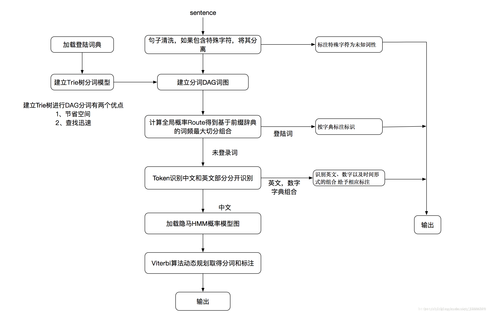
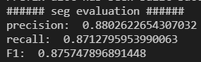
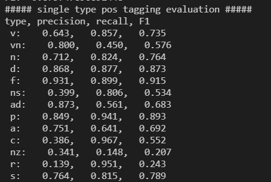
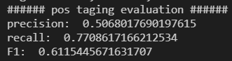

# 基于people-2014的分词与词性标注

## 1. 实验目的

+ 通过本次实验，了解中文分词及词性标注的算法及流程。
+ 通过本次实验，了解中文分词及词性标注的评价指标及计算方法。
+ 通过本次实验，学会使用分词工具处理真实数据集，得到分词结果与词性标注结果。
+ 通过本次实验，利用工具生成的分词结果和词性标注结果，编写代码实现评价指标的计算。

## 2. 实验内容

+ 自己编写代码完成对people-2014测试集文本的处理，主要包括：

  + 还原原中文语句。
  + 将每个分词的第一个字母索引和最后一个字母索引使用字符串拼接后作为主键(唯一标识符)建立字典。
  + 用合适的数据结构（字典）存储不同中文单词及词性，其中字母索引拼接后的字符串为key，单词及词性为value。

  ```python
  import os
  def load(filepath):
      file_list = os.listdir(filepath)
      sentences = ""
      words_index = []
      dict_index2type = {}
      dict_index2word = {}
      start = 0
      for filename in file_list:
          sentence = ""
          with open(filepath+filename,'r',encoding='utf-8') as f:
              lines = f.readlines()
              for line in lines:
                  elements = line.split(' ')
                  for element in elements:
                      if element == '\n' or element == '':
                          continue
                      try:
                          word,word_type = element.split('/')
                          if word[0]=='[':
                              word = word[1:]
                      except:
                          word,word_type,composed_type = element.split('/')
                          word_type = word_type[:-1]
                      sentence+=word
                      end = start + len(word)
                      index = str(start)+str(end-1) # 下标拼接后的索引
                      words_index.append(index)
                      start = end
                      dict_index2word[index] = word
                      dict_index2type[index] = word_type
              sentences+=sentence     
      return sentences, words_index, dict_index2type
  ```


+ 利用[jieba](https://github.com/fxsjy/jieba)分词工具对还原得到的中文语句进行分割和词性标注.

+ 根据分割和标注的结果，利用`实验原理`部分的公式计算分词和词性标注的`precision`，`recall`，`F1`.代码如下：

  ```python
  import load_data
  import jieba.posseg as pseg
  def evaluate(sentences, words_index, type_dict):
      words_seged = pseg.cut(sentences)
      words_seged_index = []
      seged_type_dict = {}
      start=0
      for word, flag in words_seged:
          end = start + len(word)
          index = str(start)+str(end-1)
          words_seged_index.append(index)
          start = end
          seged_type_dict[index] = flag
      # compute criteria for segmentation
      words_seged_index = set(words_seged_index)
      words_index = set(words_index)
      precision_seg = len(words_index&words_seged_index)/len(words_seged_index)
      recall_seg = len(words_index&words_seged_index)/len(words_index)
      F1_seg = 2*precision_seg*recall_seg/(precision_seg+recall_seg) 
      print("###### seg evaluation ######")
      print("precision: ",precision_seg)
      print("recall: ",recall_seg)
      print("F1: ",F1_seg)
  
      # compute criteria for pos tagging
      words_candidate = words_index&words_seged_index
      count = 0 
      dict_predict = {}
      dict_truth = {}
      dict_true_positive = {}
      for word_index in words_candidate:
  
          if type_dict[word_index] in dict_truth.keys():
              dict_truth[type_dict[word_index]] += 1
          else:
              dict_truth[type_dict[word_index]] = 1
          
          if seged_type_dict[word_index] in dict_predict.keys():
              dict_predict[seged_type_dict[word_index]] += 1
          else:
              dict_predict[seged_type_dict[word_index]] = 1
          
          if type_dict[word_index] == seged_type_dict[word_index]:
              count+=1
              if seged_type_dict[word_index] in dict_true_positive.keys():
                  dict_true_positive[seged_type_dict[word_index]] += 1
              else:
                  dict_true_positive[seged_type_dict[word_index]] = 1
      
      tp = 0
      predict_res = 0
      ground_truth = 0
      for predict_type in dict_true_positive.keys():
          precision_single_type = dict_true_positive[predict_type]/dict_predict[predict_type]
          recall_single_type = dict_true_positive[predict_type]/dict_truth[predict_type]
          F1_single_type = 2*precision_single_type*recall_single_type/(precision_single_type+recall_single_type)
          print("##### single type pos tagging evaluation #####")
          print("%s: %.3f, %.3f, %.3f"%(predict_type,precision_single_type,recall_single_type,F1_single_type))
          tp += dict_true_positive[predict_type]
          predict_res += dict_predict[predict_type]
          ground_truth += dict_truth[predict_type]
      avg_precision_postag = tp/predict_res
      avg_recall_postag = tp/ground_truth
      F1_postag = 2*avg_precision_postag*avg_recall_postag/(avg_precision_postag+avg_recall_postag)
      print("###### pos taging evaluation ######")
      print("precision: ",avg_precision_postag)
      print("recall: ",avg_recall_postag)
      print("F1: ",F1_postag)
      return
  ```

  

## 3. 实验原理

### 3.1 jieba的分词与词性标注算法

- 基于前缀词典实现高效的词图扫描，生成句子中汉字所有可能成词情况所构成的有向无环图 (`DAG`)
- 采用了动态规划查找最大概率路径, 找出基于词频的最大切分组合
- 对于未登录词，采用了基于汉字成词能力的 `HMM` 模型，使用了 `Viterbi` 算法




### 3.3 分词评价指标计算方法

$$
precision = \frac{|A\cap B|}{|B|} \tag{3.3.1} \\
$$

$$
recall = \frac{|A\cap B|}{|A|} \tag{3.3.2}
$$

$$
F1 = \frac{2*precision*recall}{precision+recall} \tag{3.3.3}
$$


​		其中公式$(3.3.1)$ 中`A`表示ground truth中分词的所有key值的集合，其中每个key为一个字符串，由每个分词的`起始位置下标`对应的字符串**拼接**`终止位置下标`对应的字符串得到, `B`表示`jieba`分词工具得到的所有分词的key值的集合，这里的key也是一个字符串，同样由起始和终止位置确定。如下所示：

| A                 | B                         | A∩B      |
| ----------------- | ------------------------- | -------- |
| ['1113' , '1416'] | ['1113' , '1415', '1516'] | ['1113'] |

​		`|A|`表示集合A中元素的个数，`|B|`表示集合B中元素的个数

### 3.4 词性标注评价指标计算方法

### 

$$
precision_i = \frac{|A_i\cap B_i|}{|B_i|} \tag{3.4.1} \\
$$


$$
recall_i = \frac{|A_i\cap B_i|}{|A_i|} \tag{3.4.2}
$$

$$
F1_i = \frac{2*precision_i*recall_i}{precision_i+recall_i} \tag{3.4.3}
$$

$$
A_i 表示ground truth中属于第i个词性类别的单词的集合
$$

$$
B_i 表示jieba工具进行词性标注后属于第i个词性类别的单词的集合
$$

​		然后采用公式$(3.4.4)-(3.4.6)$计算平均的precision，recall，F1
$$
precision = \frac{\sum_i^N{precision_i*|B_i|}}{\sum_i^N|B_i|} \tag{3.4.4}
$$

$$
recall = \frac{\sum_i^N{recall_i*|A_i|}}{\sum_i^N|A_i|} \tag{3.4.5}
$$

$$
F1 = \frac{2*precision*recall}{precision+recall} \tag{3.4.6}
$$

​		其中N为所有标注类别的数目，在本数据集中`jieba`可标注的类别有40类，如`实验结果及分析`所示。


## 4. 实验结果及分析

### 4.1 分词评价指标计算结果及分析

| precision | recall | F1    |
| --------- | ------ | ----- |
| 0.880     | 0.871  | 0.876 |

​		如上表所示，`jieba`分词工具的精确率，召回率，F1都是比较高的，启示我们后续开展NLP工作时可以基于`jieba`进行。代码执行结果如下：



### 4.2 词性标注评价指标计算结果及分析

​		按照出现频次，对测试集中`jieba`工具可以标注的词性进行词频统计，并计算对应评价指标

| 符号   | 含义     | 次数 | precision | recall    | F1        |
| ------ | -------- | ---- | --------- | --------- | --------- |
| n      | 普通名词 | 3492 | 0.712     | 0.824     | 0.764     |
| v      | 普通动词 | 2517 | 0.643     | 0.857     | 0.735     |
| vn     | 名动词   | 1031 | 0.800     | 0.450     | 0.576     |
| d      | 副词     | 872  | 0.868     | 0.877     | 0.873     |
| p      | 介词     | 747  | 0.849     | 0.941     | 0.893     |
| a      | 形容词   | 415  | 0.751     | 0.641     | 0.692     |
| ns     | 地名     | 381  | 0.399     | 0.967     | 0.552     |
| m      | 数量词   | 305  | 0.423     | 0.905     | 0.577     |
| nz     | 其他专名 | 290  | 0.341     | 0.148     | 0.207     |
| f      | 方位名词 | 287  | 0.931     | 0.899     | 0.915     |
| c      | 连词     | 243  | 0.386     | 0.967     | 0.552     |
| t      | 时间     | 179  | 0.681     | 0.905     | 0.777     |
| b      | 区别词   | 161  | 0.648     | 0.366     | 0.468     |
| nr     | 人名     | 137  | 0.307     | 0.898     | 0.458     |
| ad     | 副形词   | 123  | 0.873     | 0.561     | 0.683     |
| s      | 处所名词 | 119  | 0.764     | 0.815     | 0.789     |
| q      | 量词     | 112  | 0.737     | 0.250     | 0.373     |
| x      | 非语素字 | 85   | 0.004     | 0.165     | 0.008     |
| r      | 代词     | 81   | 0.139     | 0.951     | 0.243     |
| ng     | 名语素   | 57   | 0.917     | 0.193     | 0.319     |
| an     | 名形词   | 31   | 1.000     | 0.323     | 0.488     |
| nt     | 机构名   | 22   | 0.333     | 0.818     | 0.474     |
| vd     | 动副词   | 20   | 0.857     | 0.300     | 0.444     |
| vg     | 动语素   | 9    | 0.857     | 0.667     | 0.750     |
| k      | 后接成分 | 7    | 1.000     | 0.857     | 0.923     |
| u      | 其他助词 | 6    | 0.055     | 1.000     | 0.103     |
| z      | 状态词   | 5    | 0.667     | 0.800     | 0.727     |
| tg     | 时语素   | 5    | 1.000     | 0.400     | 0.571     |
| y      | 语气词   | 3    | 1.000     | 0.667     | 0.800     |
| l      | 习用语   | 2    | 0.023     | 1.000     | 0.044     |
| 平均值 |          |      | **0.507** | **0.771** | **0.612** |

​		

​		如上表，`jieba`词性标注对于普通名词，普通动词，副词，介词等词性识别较为准确，但对于地名，专有名词等词性的词性识别效果较差，原因是我们并未使用people-2014的训练集进行训练，也没有提供people-2014的词典给jieba工具，所以未登录词占比过高，所以导致词性识别效果较差。代码结果如下：



