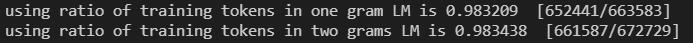
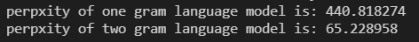
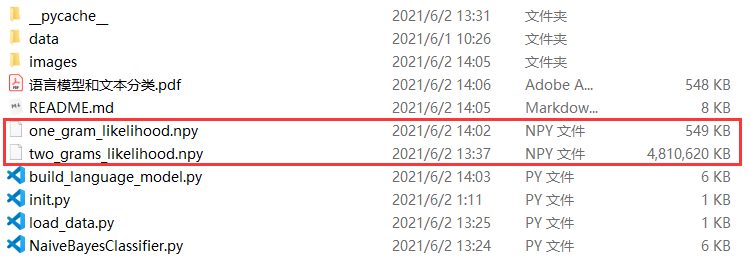
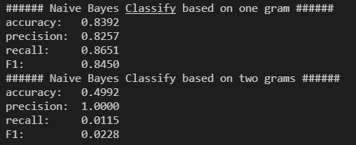
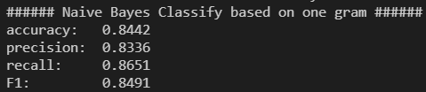

# 语言模型和文本分类

[toc]

# 实验目的

+ 了解`一元语法，二元语法`及n元语法，并学会在训练集上建立对应的语言模型
+ 了解朴素贝叶斯分类的原理，并能利用该原理，在语言模型的基础上，完成对测试集文本的分类
+ 了解语言模型评价指标`困惑度`，以及分类评价指标：`准确率，召回率，F1`

# 实验内容

## 1.建立语言模型

### 1.1 一元语法模型

+ 读取`vocab.txt`，建立一个初值为0的，大小为vocabs_size*2的`numpy`数组`likelihood`。
+ 使用`jieba`分词工具将训练集中的句子分词，然后利用`likelihood`数组统计每个token出现的次数。其中，likelihood第二维维度大小为2，分别代表在label等于0条件下token出现的次数和label等于1条件下token出现的次数。由于需要将token次数转换成频率来代表概率，所以在统计的过程中需要记录总共使用的token数`total_tokens_used`。
+ 利用`likelihood = likelihood/total_tokens_used`将次数转换为频率来代表概率，从而完成一元语法模型的构建。
+ 使用`laplace`法制对概率矩阵进行平滑，保证没有为0的值。
+ 在测试集上使用困惑度对一元语法模型进行评估。

### 1.2 二元语法模型

+ 读取`vocab.txt`，建立一个初值为0的，类型为`uint16`，大小为`vocabs_size*vocabs_size*2`的`numpy`数组`likelihood`。使用`uint16`而不是`float32`是因为`likelihood`数组维度太大，假如使用float32或者float64，不仅保存的文件很大（uint16保存的矩阵文件4G，float32是8G，float是16G+），而且后续实验中对矩阵进行操作时经常出现`memory error`，所以考虑到每个二元组出现的次数不会超过2^16，所以可以先使用uint16存储次数，并同时存储总的二元组的 数量，这样可以后续在使用时利用这两个整数求出需要的概率值。而最后一维维度为2，代表label=0或1两种类别，只有分开统计，后面Naive Bayes Classifier才能利用该语言模型。
+ 使用jieba分词工具对训练集中的句子进行分词，利用likelihood数组统计每个token出现的次数，并同时统计总共使用的token数`total_tokens_used`。
+ 使用`laplace`法制对概率矩阵进行平滑，保证没有为0的值。
+ 在测试集上使用困惑度对二元语法模型进行评估。

## 2.朴素贝叶斯分类

+ 读取一元语法模型文件或二元语法模型文件
+ 读取测试集文本，利用jieba分词得到tokens
+ 读取vocab.txt，利用token在vocab.txt中的位置，访问likelihood概率矩阵，计算出该token对应的P(token|c)或P(token，last_token|c)，`（其中c取值0或1，代表两个不同的类别;并且在计算过程中使用laplace平滑来消除0概率）`，接着取log对数后分别累加到正向概率pos_prob和负向概率neg_prob上.
+ 最后比较pos_prob和neg_prob，输出概率大的类别作为text的类别.
+ 使用评价指标对朴素贝叶斯的性能进行评价。


# 实验原理

## 1.语言模型

### 1.1 定义

+ 设词语序列
  $$
  s=w_1w_2…w_l
  $$

+ 

$$
p(s)=p(w_1w_2...w_l)=\prod_{i=1}^l{p(w_i|w_1...w_{i-1})}
$$

​		其中每一个条件概率都是模型的一个参数。

### 1.2 建立过程

+ 确定模型的参数的集合
+ 确定模型各参数的值

### 1.3 分类

+ 一元语法模型：假设下一个词的出现依赖它前面的0个词
+ 二元语法模型：假设下一个词的出现依赖它前面的1个词
+ n元语法模型：假设下一个词的出现依赖它前面的n-1个词

### 1.4 评价指标

困惑度：Perplexity测试集概率的倒数
$$
PP(W) = P(w_1w_2...w_N)^{-\frac{1}{N}}
$$
困惑度一般越小越好，但是过小往往在实际使用时效果不好，一般困惑度范围在1~1000

## 2. 朴素贝叶斯分类

### 2.1 模型

$$
P(c|d) = \frac{P(d|c)P(c)}{P(d)}                     \tag{1}
$$

$$
P(d|c) = P(x_1,x_2,...,x_n|c)=P(x_1|c)P(x_2|c)...P(x_n|c)  \tag{2}
$$

$$
C_{NB} = \underset{c\in C}{argmax}\frac{P(d|c)P(c)}{P(d)} =\underset{c\in C}{argmax}P(c)\prod_{x\in X}{P(x|c)}  \tag{3}
$$

贝叶斯公式(1)所示，P(d)表示文档出现的概率。而朴素贝叶斯假设各变量之间相互独立，所以可得公式(2)。利用朴素贝叶斯进行分类时，需要求是的P(c|d)发生概率最大的类别的`c`。在二元语法模型中，我将朴素贝叶斯公式求分类推广为：
$$
C_{NB} =\underset{c\in C}{argmax}P(c)\prod_{i=1}^l{P(t,t_{i-1}|c)}  \tag{4}
$$


### 2.2 评价指标

+ accuracy
  $$
  accuracy = (tp+tf)/samples\_num
  $$
  
+ precision

$$
precision=tp/(tp+fp)
$$

+ recall
  $$
  recall = tp/(tp+fn)
  $$
  
+ F1
  $$
  F1 = \frac{2*precision*recall}{precision+recall}
  $$
  

## 3. 数据平滑

+ Laplace法则（由于本次实验只使用了Laplace法则，所以其他平滑方法并未引入介绍）

$$
P_{lap}(w_i|w_{i-1})=\frac{C(w_{i-1}w_i)+1}{C(w_i)+|V|}
$$

​	`|V|`表示词汇表中单词的个数


# 实验结果及分析

## 1.语言模型构建及评价

执行以下命令，可以快速构建语言模型，并将模型保存在npy文件中，注意，由于模型较大，需要要求内存>=16G

```
python build_language_model.py
```

+ 构建过程中的输出信息如下：



​			其中在构建一元语法模型时使用了训练集中在vocab.txt中有对应词汇的652441个token，而663583为训练		集中有的token，可以看到有效使用的token的比率在98%左右。

​			在构建二元语法模型时，情况类似，总共有661587个`[token,last_token]对`被使用，使用比率也在98%		左右，充分挖掘了训练集的信息。（对于last_token不在vocab.txt中的情况，我们使用了当前token前面距离		当前token最近的在vocabs中的一个token作为last_token）

+ 困惑度评价结果如下：



​			看出一元语法模型在测试集上的困惑度为`440`，而二元语法模型的困惑度为`65`，从困惑度角度看，二元语		法模型优于一元语法模型。这也验证了我们课上讲的

> n越大，对下一个词出现的约束信息更多，具有更强的辨别力。
>
> 理论上，n越大越好

+ 模型文件示意图：



## 2. 朴素贝叶斯分类

执行以下命令，可以分别基于一元语言模型和二元语言模型完成朴素贝叶斯分类

```shell
python NaiveBayesClassifier.py
```

分类评价指标如下：



​        从上图看出，在测试集上，基于一元语言模型的朴素贝叶斯分类准确率在83%，效果相当不错。已经达到了预期目标。而基于二元语言模型的朴素贝叶斯分类准确率只有49.9%，说明模型是在以1/2的概率随机乱猜，说明我在实现过程中，二元语言模型构建或者基于二元语言模型的朴素贝叶斯公式可能存在问题，这是之后需要优化和改进的一个地方，也希望老师能够指出问题，我及时改正。

​        在以上的基础上，我进行了进一步实验，发现在基于一元语法模型的朴素贝叶斯分类中，不采用laplace平滑，简单的将0概率以一个很小的概率（1e-8）替换后，模型的准确率有所提升，证明了平滑对于分类任务的影响还是很大的，固定值替换后的测试效果如下：




