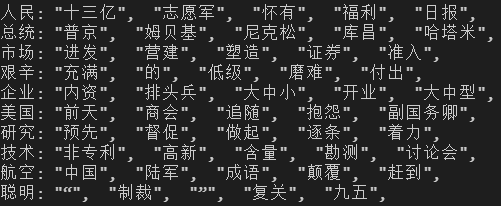
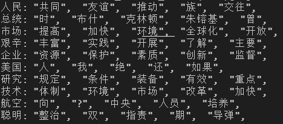

# 词向量

[toc]

# 实验目的

+ 了解`TFIDF`,`PMI`,`Word2Vec`等稀疏或密集词向量表示方法
+ 在给定数据集上实现`TFIDF`,`Word2Vec`词向量表示方法，并基于词向量表示结果，计算出给定十个词的top5匹配结果，进一步了解不同词向量表示方法的区别和作用。

# 实验内容

## 1.TFIDF

+ 读取`input.txt`，建立词汇表`Vocab`(两个字典，一个可以实现通过token查询对应index，另一个实现通过index查询对应token)。
+ 使用半径为2的滑动窗口对训练文本进行统计，统计出每个中心词对应的上下文中各目标词出现的次数，建立词词共生矩阵`mat`，从而确定TFIDF词向量。
+ 建立的共生矩阵中，mat的每一行为一个单词的词向量，计算给定单词的词向量与所有单词词向量之间的cosine相似度，并按照从大到小依次降序，得到top5的最匹配的单词。

## 2.Word2Vec

+ 读取`input.txt`，对每个sentence进行分割，建立一个二维列表words([sentence_num, words_in_per_sentence])作为gensim的输入。
+ 利用`model = gensim.models.Word2Vec(words,min_count=2)`建立word2vec模型，并用给定训练集进行训练。
+ 利用`result = model.most_similar_cosmul(word)[:5]`获取与给定单词cosine相似度最大的五个候选词作为输出。

# 实验原理

## 1.TFIDF

+ 一种稀疏词向量表示方法，维度往往都上万维

+ 词频TF（Term Frequency）
  $$
  tf_{t,d} = count(t,d)     \tag{1}
  $$

+ 逆文档频率IDF（inverse Document Frequency）
  $$
  idf_t = \frac{N}{df_t}  \tag{2}
  $$
  其中，逆文档频率是为了减小在多个文档都出现的词对词向量的影响，如the，a等。增加在少量文档中出现的单词对于词向量的影响。其中N在我们词词共生矩阵中代表目标词的数量，及词汇表的大小，而dft表示目标词出现在中心词上下文的数量(在一个上下文中出现多次算一次)。

+ TFIDF
  $$
  tfidf_t = tf_{t,d}*idf_t \tag{3}
  $$
  

## 2.Word2Vec

+ 一种密集词向量表示方法，维度往往只有几百或者几千。

+ 不在统计计算词*w* 在邻域中出现其他词的频率，而是训练一个二元分类器：*w* 邻域中出现其他词的可能性有多大。
+ 分类不是目的，目的是获得**分类器的权重**作为**词嵌入向量**
+ 无需监督训练手动标注
+ Word2Vec中的Skim-gram算法：
  + 1.正样本：选择目标词的一个邻域词为正样本
  + 2.负样本：随机选择词表中的一个其他词为负样本
  + 3.使用逻辑回归训练一个分类器区分这两种情况
  + 4.使用网络权重向量作为嵌入向量

## 3.Cosine相似度

Cosine相似度使用两向量之间的Cosine距离来衡量，由于取值范围为`[-1,+1]`，当两向量一样时，cosine值为1，当两向量正交时，cosine值为0，当两向量完全相反时，cosine值为0。具体计算公式如下：
$$
Distance_{cos}(a,b)  =  \frac{a·b}{|a||b|}  \tag{4}
$$

# 实验结果及分析

从数据集中选取'人民', '总统', '市场', '艰辛', '企业', '美国', '研究', '技术', '航空', '聪明'，在TFIDF和Word2Vec词向量方法下，分别计算给定词与其他词的cosine相似度，选取相似度最高的Top5作为最终的输出结果，实验结果如下

## 1.TFIDF

在TFIDF方法的输出中，我们看到与人民相似的词有："十三亿",  "志愿军",  "怀有",  "福利",  "日报"；与总统相似的词有： "普京",  "姆贝基",  "尼克松",  "库昌",  "哈塔米"；可以看出来TFIDF词向量方法来表示词能够很好的分析到词与词之间的联系和关系。

## 2.Word2Vec

在Word2Vec的输出中，我们从总统的相似词:"时",  "布什",  "克林顿",  "朱镕基",  "曾"中看出Word2Vec也能够较好的表示词与词之间的上下文关系。但是由于缺乏定量的指标评估，从此次实验中我们无法分析出其与TFIDF的优劣。但是由于Word2Vec表示更加密集，在自然语言处理中主流方法还是使用Word2Vec。

