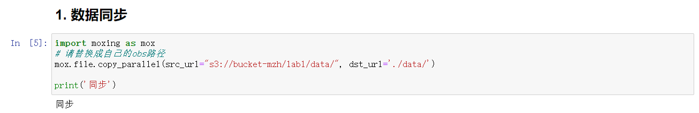
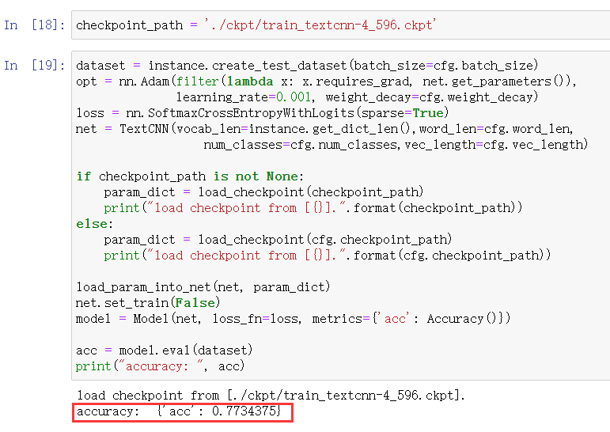
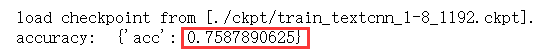
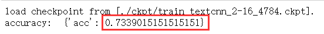
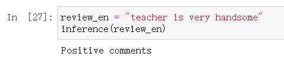

# 实验1 基于TextCNN的情感分类

[TOC]


# 1.实验背景

​		`文本分类( text classification)`,又称文档分类( document classification),指的是将一个文档归类到一个或多个类别中的自然语言处理任务。文本分类的应用场景非常广泛，涵盖垃圾邮件过滤、垃圾评论过滤、自动标签、`情感分析`等任何需要自动归档文本的场合。

​		情感分析是自然语言处理文本分类任务的应用场景之一，情感分类较为简单，实用性也较强。常见的购物网站、电影网站都可以采集到相对高质量的数据集，也很容易给业务领域带来收益。例如，可以结合领域上下文，自动分析特定类型客户对当前产品的意见，可以分主题分用户类型对情感进行分析，以作针对性的处理，甚至基于此进一步推荐产品，提高转化率，带来更高的商业收益。

​		本实验主要基于卷积神经网络对电影评论信息进行情感分析，判断其情感倾向。

# 2.实验目的

- 理解文本分类的基本流程
- 理解CNN网络在文本任务中的用法
- 掌握MindSpore搭建文本分类模型的方法

# 3.实验步骤

## 3.1 实验准备

- 使用OBS创建项目文件夹

- 上传实验源码及数据


## 3.2 实验过程

+ 同步数据和源码到本地容器

```python
import moxing as mox
# 请替换成自己的obs路径
mox.file.copy_parallel(src_url="s3://bucket-mzh/lab1/data/", dst_url='./data/') 
```



+ 设置超参数，运行环境，预览数据

```python
from easydict import EasyDict as edict

cfg = edict({
    'name': 'movie review',
    'pre_trained': False,
    'num_classes': 2,
    'batch_size': 64,
    'epoch_size': 4,
    'weight_decay': 3e-5,
    'data_path': './data/',
    'device_target': 'Ascend',
    'device_id': 0,
    'keep_checkpoint_max': 1,
    'checkpoint_path': './ckpt/train_textcnn-4_149.ckpt',
    'word_len': 51,
    'vec_length': 40
})
```

- 数据预处理，并生成数据集和测试集

```python
# 数据预览
with open("./data/rt-polarity.neg", 'r', encoding='utf-8') as f:
        print("Negative reivews:")
        for i in range(5):
            print("[{0}]:{1}".format(i,f.readline()))
with open("./data/rt-polarity.pos", 'r', encoding='utf-8') as f:
        print("Positive reivews:")
        for i in range(5):
            print("[{0}]:{1}".format(i,f.readline()))
class Generator():
    def __init__(self, input_list):
        self.input_list=input_list
    def __getitem__(self,item):
        return (np.array(self.input_list[item][0],dtype=np.int32),
                np.array(self.input_list[item][1],dtype=np.int32))
    def __len__(self):
        return len(self.input_list)


class MovieReview:
    '''
    影评数据集
    '''
    def __init__(self, root_dir, maxlen, split):
        '''
        input:
            root_dir: 影评数据目录
            maxlen: 设置句子最大长度
            split: 设置数据集中训练/评估的比例
        '''
        self.path = root_dir
        self.feelMap = {
            'neg':0,
            'pos':1
        }
        self.files = []

        self.doConvert = False
        
        mypath = Path(self.path)
        if not mypath.exists() or not mypath.is_dir():
            print("please check the root_dir!")
            raise ValueError

        # 在数据目录中找到文件
        for root,_,filename in os.walk(self.path):
            for each in filename:
                self.files.append(os.path.join(root,each))
            break

        # 确认是否为两个文件.neg与.pos
        if len(self.files) != 2:
            print("There are {} files in the root_dir".format(len(self.files)))
            raise ValueError

        # 读取数据
        self.word_num = 0
        self.maxlen = 0
        self.minlen = float("inf")
        self.maxlen = float("-inf")
        self.Pos = []
        self.Neg = []
        for filename in self.files:
            f = codecs.open(filename, 'r')
            ff = f.read()
            file_object = codecs.open(filename, 'w', 'utf-8')
            file_object.write(ff)
            self.read_data(filename)
        self.PosNeg = self.Pos + self.Neg

        self.text2vec(maxlen=maxlen)
        self.split_dataset(split=split)

    def read_data(self, filePath):

        with open(filePath,'r') as f:
            
            for sentence in f.readlines():
                sentence = sentence.replace('\n','')\
                                    .replace('"','')\
                                    .replace('\'','')\
                                    .replace('.','')\
                                    .replace(',','')\
                                    .replace('[','')\
                                    .replace(']','')\
                                    .replace('(','')\
                                    .replace(')','')\
                                    .replace(':','')\
                                    .replace('--','')\
                                    .replace('-',' ')\
                                    .replace('\\','')\
                                    .replace('0','')\
                                    .replace('1','')\
                                    .replace('2','')\
                                    .replace('3','')\
                                    .replace('4','')\
                                    .replace('5','')\
                                    .replace('6','')\
                                    .replace('7','')\
                                    .replace('8','')\
                                    .replace('9','')\
                                    .replace('`','')\
                                    .replace('=','')\
                                    .replace('$','')\
                                    .replace('/','')\
                                    .replace('*','')\
                                    .replace(';','')\
                                    .replace('<b>','')\
                                    .replace('%','')
                sentence = sentence.split(' ')
                sentence = list(filter(lambda x: x, sentence))
                if sentence:
                    self.word_num += len(sentence)
                    self.maxlen = self.maxlen if self.maxlen >= len(sentence) else len(sentence)
                    self.minlen = self.minlen if self.minlen <= len(sentence) else len(sentence)
                    if 'pos' in filePath:
                        self.Pos.append([sentence,self.feelMap['pos']])
                    else:
                        self.Neg.append([sentence,self.feelMap['neg']])

    def text2vec(self, maxlen):
        '''
        将句子转化为向量

        '''
        # Vocab = {word : index}
        self.Vocab = dict()

        # self.Vocab['None']
        for SentenceLabel in self.Pos+self.Neg:
            vector = [0]*maxlen
            for index, word in enumerate(SentenceLabel[0]):
                if index >= maxlen:
                    break
                if word not in self.Vocab.keys():
                    self.Vocab[word] = len(self.Vocab)
                    vector[index] = len(self.Vocab) - 1
                else:
                    vector[index] = self.Vocab[word]
            SentenceLabel[0] = vector
        self.doConvert = True

    def split_dataset(self, split):
        '''
        分割为训练集与测试集

        '''

        trunk_pos_size = math.ceil((1-split)*len(self.Pos))
        trunk_neg_size = math.ceil((1-split)*len(self.Neg))
        trunk_num = int(1/(1-split))
        pos_temp=list()
        neg_temp=list()
        for index in range(trunk_num):
            pos_temp.append(self.Pos[index*trunk_pos_size:(index+1)*trunk_pos_size])
            neg_temp.append(self.Neg[index*trunk_neg_size:(index+1)*trunk_neg_size])
        self.test = pos_temp.pop(2)+neg_temp.pop(2)
        self.train = [i for item in pos_temp+neg_temp for i in item]

        random.shuffle(self.train)
        # random.shuffle(self.test)

    def get_dict_len(self):
        '''
        获得数据集中文字组成的词典长度
        '''
        if self.doConvert:
            return len(self.Vocab)
        else:
            print("Haven't finished Text2Vec")
            return -1

    def create_train_dataset(self, epoch_size, batch_size):
        dataset = ds.GeneratorDataset(
                                        source=Generator(input_list=self.train), 
                                        column_names=["data","label"], 
                                        shuffle=False
                                        )
#         dataset.set_dataset_size(len(self.train))
        dataset=dataset.batch(batch_size=batch_size,drop_remainder=True)
        dataset=dataset.repeat(epoch_size)
        return dataset

    def create_test_dataset(self, batch_size):
        dataset = ds.GeneratorDataset(
                                        source=Generator(input_list=self.test), 
                                        column_names=["data","label"], 
                                        shuffle=False
                                        )
#         dataset.set_dataset_size(len(self.test))
        dataset=dataset.batch(batch_size=batch_size,drop_remainder=True)
        return dataset
```

- 模型构建

```python
class TextCNN(nn.Cell):
    def __init__(self, vocab_len, word_len, num_classes, vec_length):
        super(TextCNN, self).__init__()
        self.vec_length = vec_length
        self.word_len = word_len
        self.num_classes = num_classes

        self.unsqueeze = ops.ExpandDims()
        self.embedding = nn.Embedding(vocab_len, self.vec_length, embedding_table='normal')

        self.slice = ops.Slice()
        self.layer1 = self.make_layer(kernel_height=3)
        self.layer2 = self.make_layer(kernel_height=4)
        self.layer3 = self.make_layer(kernel_height=5)

        self.concat = ops.Concat(1)

        self.fc = nn.Dense(96*3, self.num_classes)
        self.drop = nn.Dropout(keep_prob=0.5)
        self.print = ops.Print()
        self.reducemean = ops.ReduceMax(keep_dims=False)
        
    def make_layer(self, kernel_height):
        return nn.SequentialCell(
            [
                make_conv_layer((kernel_height,self.vec_length)),
                nn.ReLU(),
                nn.MaxPool2d(kernel_size=(self.word_len-kernel_height+1,1)),
            ]
        )

    def construct(self,x):
        x = self.unsqueeze(x, 1)
        x = self.embedding(x)
        x1 = self.layer1(x)
        x2 = self.layer2(x)
        x3 = self.layer3(x)

        x1 = self.reducemean(x1, (2, 3))
        x2 = self.reducemean(x2, (2, 3))
        x3 = self.reducemean(x3, (2, 3))

        x = self.concat((x1, x2, x3))
        x = self.drop(x)
        x = self.fc(x)
        return x
```

- 性能评估

```python
dataset = instance.create_test_dataset(batch_size=cfg.batch_size)
opt = nn.Adam(filter(lambda x: x.requires_grad, net.get_parameters()), 
              learning_rate=0.001, weight_decay=cfg.weight_decay)
loss = nn.SoftmaxCrossEntropyWithLogits(sparse=True)
net = TextCNN(vocab_len=instance.get_dict_len(),word_len=cfg.word_len,
                  num_classes=cfg.num_classes,vec_length=cfg.vec_length)

if checkpoint_path is not None:
    param_dict = load_checkpoint(checkpoint_path)
    print("load checkpoint from [{}].".format(checkpoint_path))
else:
    param_dict = load_checkpoint(cfg.checkpoint_path)
    print("load checkpoint from [{}].".format(cfg.checkpoint_path))

load_param_into_net(net, param_dict)
net.set_train(False)
model = Model(net, loss_fn=loss, metrics={'acc': Accuracy()})

acc = model.eval(dataset)
print("accuracy: ", acc)
```


# 4.实验原理-TextCNN


​		上图很好地诠释了模型的框架。假设我们有一些句子需要对其进行分类。句子中每个词是由n维词向量组成的，也就是说输入矩阵大小为m*n，其中m为句子长度。CNN需要对输入样本进行卷积操作，对于文本数据，filter不再横向滑动，仅仅是向下移动，有点类似于N-gram在提取词与词间的局部相关性。图中共有三种步长策略，分别是2,3,4，每个步长都有两个filter（实际训练时filter数量会很多）。在不同词窗上应用不同filter，最终得到6个卷积后的向量。然后对每一个向量进行最大化池化操作并拼接各个池化值，最终得到这个句子的特征表示，将这个句子向量丢给分类器进行分类，至此完成整个流程。

## 4.1嵌入层（Embedding Layer）

通过一个隐藏层, 将 one-hot 编码的词投影到一个低维空间中，本质上是特征提取器，在指定维度中编码语义特征。 这样, 语义相近的词, 它们的欧氏距离或余弦距离也比较近。（作者使用的单词向量是预训练的，方法为fasttext得到的单词向量，当然也可以使用word2vec和GloVe方法训练得到的单词向量）。

## 4.2卷积层（Convolution Laye）

在处理图像数据时，CNN使用的卷积核的宽度和高度的一样的，但是在text-CNN中，卷积核的宽度是与词向量的维度一致！这是因为我们输入的每一行向量代表一个词，在抽取特征的过程中，词做为文本的最小粒度。而高度和CNN一样，可以自行设置（通常取值2,3,4,5），高度就类似于n-gram了。由于我们的输入是一个句子，句子中相邻的词之间关联性很高，因此，当我们用卷积核进行卷积时，不仅考虑了词义而且考虑了词序及其上下文（类似于skip-gram和CBOW模型的思想）。

## 4.3池化层（Pooling Layer）

因为在卷积层过程中我们使用了不同高度的卷积核，使得我们通过卷积层后得到的向量维度会不一致，所以在池化层中，我们使用1-Max-pooling对每个特征向量池化成一个值，即抽取每个特征向量的最大值表示该特征，而且认为这个最大值表示的是最重要的特征。当我们对所有特征向量进行1-Max-Pooling之后，还需要将每个值给拼接起来。得到池化层最终的特征向量。在池化层到全连接层之前可以加上dropout防止过拟合。

## 4.4全连接层（Fully connected layer）

全连接层跟其他模型一样，假设有两层全连接层，第一层可以加上’relu’作为激活函数，第二层则使用softmax激活函数得到属于每个类的概率。

## 4.5TextCNN的小变种

在词向量构造方面可以有以下不同的方式： CNN-rand: 随机初始化每个单词的词向量通过后续的训练去调整。 CNN-static: 使用预先训练好的词向量，如word2vec训练出来的词向量，在训练过程中不再调整该词向量。 CNN-non-static: 使用预先训练好的词向量，并在训练过程进一步进行调整。 CNN-multichannel: 将static与non-static作为两通道的词向量。

## 4.6参数与超参数

+ sequence_length （Q: 对于CNN, 输入与输出都是固定的，可每个句子长短不一, 怎么处理? A: 需要做定长处理, 比如定为n, 超过的截断, 不足的补0. 注意补充的0对后面的结果没有影响，因为后面的max-pooling只会输出最大值，补零的项会被过滤掉）
+ num_classes （多分类, 分为几类）
+ vocabulary_size （语料库的词典大小, 记为|D|）
+ embedding_size （将词向量的维度, 由原始的 |D| 降维到 embedding_size）
+ filter_size_arr （多个不同size的filter）

# 5.实验结果及分析

## 5.1实验结果

### batch_size = 64,epoch = 4



### batch_size = 64,epoch= 8



### batch_size = 32,epoch = 16

​	

### 在线测试



| Review                                                       | Pre_class | Ground_truth |
| ------------------------------------------------------------ | --------- | ------------ |
| the movie is so boring                                       | Negative  | Negative     |
| the movie is so good                                         | Positive  | Positive     |
| the man is so crazy                                          | Positive  | Positive     |
| There are some boring plots in the movie, but overall it's great | Negative  | Positive     |
| The boy is great                                             | Positive  | Positive     |
| It looks great, but it's not practical                       | Positive  | Negative     |
| it's so laddish and juvenile , only teenage boys could possibly find it funny | Negative  | Negative     |
| a visually flashy but narratively opaque and emotionally vapid exercise in style and mystification | Negative  | Negative     |
| if you sometimes like to go to the movies to have fun , wasabi is a good place to start | Positive  | Positive     |

## 5.2分析

​		了解文本分类任务的基本流程，同时理解卷积网络在文本任务中的使用方法，通过实验也加深了对CNN网络的理解，同时提升了代码实践能力。模型对于前后转折的长文本的评论分类效果不好，丢失前后语义信息，导致分类错误