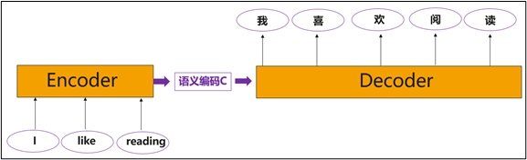
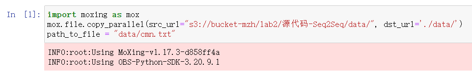
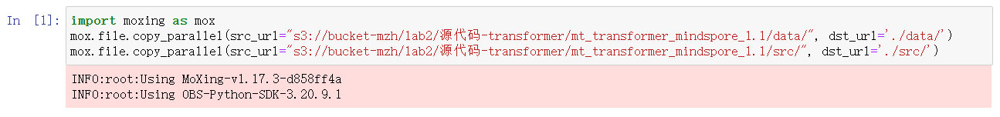
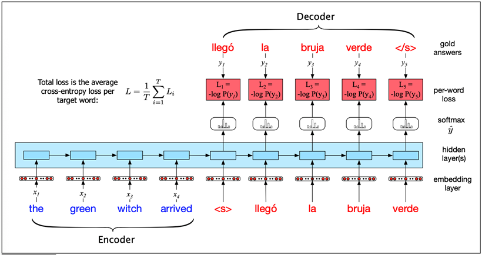
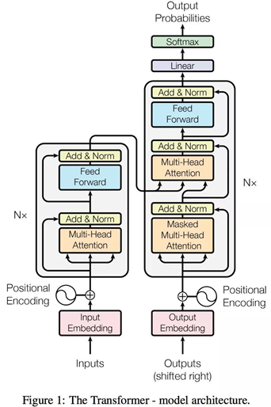
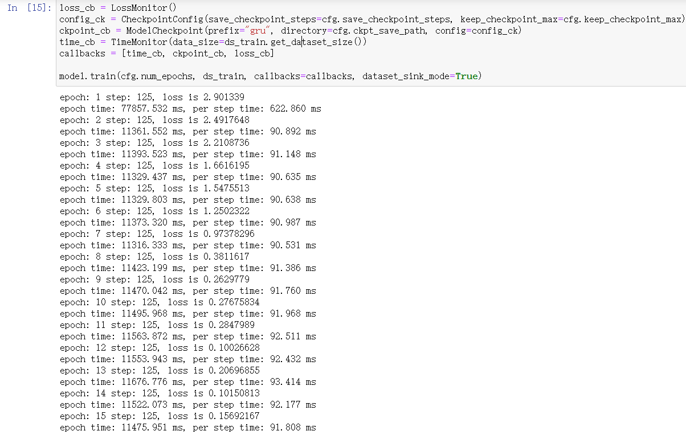
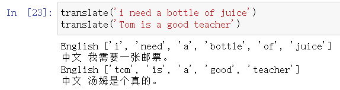
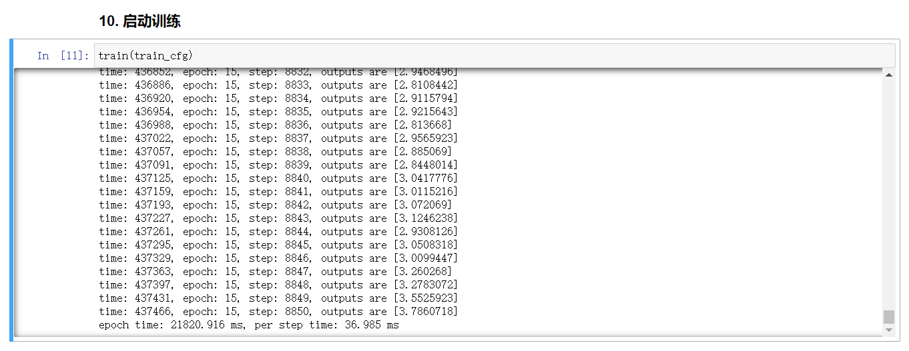
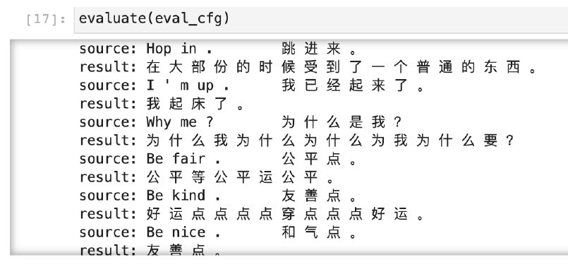

# 实验2 机器翻译

[TOC]

# 1.实验背景及简介

## 1.1实验背景

​		在实际生活中，机器翻译是人工智能技术比较广泛的一个应用。在机器翻译应用中，由于输入序列与输出序列的长度通常不一样。需要采用序列到序列（Sequence to Sequene, Seq2Seq）的映射框架来解决这一问题，它能将一个可变长序列映射到另一个可变长序列。本次实验将探索Seq2Seq基础模型在机器翻译中的应用，以及Attention注意力机制、Transformer模型对基础Seq2Seq模型的改进。

## 1.2实验简介

​		翻译任务在日常生活应用广泛，如手机中有各种翻译软件，可以满足人们交流、阅读的需求。本实验基于Seq2Seq编码器-解码器框架，结合GRU单元实现英文转中文的翻译任务，框架示意图如下：

​                    

> ​		GRU（门递归单元）是一种递归神经网络算法，就像LSTM（长短期存储器）一样。它是由Kyunghyun Cho、Bart van Merrienboer等在2014年的文章“使用RNN编码器-解码器学习短语表示用于统计机器翻译”中提出的。本文提出了一种新的神经网络模型RNN Encoder-Decoder，该模型由两个递归神经网络（RNN）组成，为了提高翻译任务的效果，我们还参考了“神经网络的序列到序列学习”和“联合学习对齐和翻译的神经机器翻译”。

# 2.实验目的

1. 掌握神经网络在NLP机器翻译领域的应用
2. 理解seq2seq解码器-编码器框架
3. 理解attention注意力机制，transformer架构

# 3.实验步骤

## 3.1 数据上传与同步(OBS)


+ Seq2Seq



+ Transformer



## 3.1 Seq2Seq

- 数据预处理

```python
def prepare_data(data_path, vocab_save_path, max_seq_len):
    with open(data_path, 'r', encoding='utf-8') as f:
        data = f.read()

    # 读取文本文件，按行分割，再将每行分割成语句对
    data = data.split('\n')

     # 截取前2000行数据进行训练
    data = data[:2000]

    # 分割每行中的中英文
    en_data = [normalizeString(line.split('\t')[0]) for line in data]

    ch_data = [line.split('\t')[1] for line in data]

    # 利用集合，获得中英文词汇表
    en_vocab = set(' '.join(en_data).split(' '))
    id2en = [EOS] + [SOS] + list(en_vocab)
    en2id = {c:i for i,c in enumerate(id2en)}
    en_vocab_size = len(id2en)
    # np.savetxt(os.path.join(vocab_save_path, 'en_vocab.txt'), np.array(id2en), fmt='%s')

    ch_vocab = set(''.join(ch_data))
    id2ch = [EOS] + [SOS] + list(ch_vocab)
    ch2id = {c:i for i,c in enumerate(id2ch)}
    ch_vocab_size = len(id2ch)
    # np.savetxt(os.path.join(vocab_save_path, 'ch_vocab.txt'), np.array(id2ch), fmt='%s')

    # 将句子用词汇表id表示
    en_num_data = np.array([[1] + [int(en2id[en]) for en in line.split(' ')] + [0] for line in en_data])
    ch_num_data = np.array([[1] + [int(ch2id[ch]) for ch in line] + [0] for line in ch_data])

    #将短句子扩充到统一的长度
    for i in range(len(en_num_data)):
        num = max_seq_len + 1 - len(en_num_data[i])
        if(num >= 0):
            en_num_data[i] += [0]*num
        else:
            en_num_data[i] = en_num_data[i][:max_seq_len] + [0]

    for i in range(len(ch_num_data)):
        num = max_seq_len + 1 - len(ch_num_data[i])
        if(num >= 0):
            ch_num_data[i] += [0]*num
        else:
            ch_num_data[i] = ch_num_data[i][:max_seq_len] + [0]
    
    
    np.savetxt(os.path.join(vocab_save_path, 'en_vocab.txt'), np.array(id2en), fmt='%s')
    
    np.savetxt(os.path.join(vocab_save_path, 'ch_vocab.txt'), np.array(id2ch), fmt='%s')

    return en_num_data, ch_num_data, en_vocab_size, ch_vocab_size
```

- 设置超参数

```python
from easydict import EasyDict as edict

# CONFIG
cfg = edict({
    'en_vocab_size': 1154,
    'ch_vocab_size': 1116,
    'max_seq_length': 10,
    'hidden_size': 1024,
    'batch_size': 16,
    'eval_batch_size': 1,
    'learning_rate': 0.001,
    'momentum': 0.9,
    'num_epochs': 15,
    'save_checkpoint_steps': 125,
    'keep_checkpoint_max': 10,
    'dataset_path':'./preprocess',
    'ckpt_save_path':'./ckpt',
    'checkpoint_path':'./ckpt/gru-15_125.ckpt'
})
```

- GRU单元

```python
class GRU(nn.Cell):
    def __init__(self, config, is_training=True):
        super(GRU, self).__init__()
        if is_training:
            self.batch_size = config.batch_size
        else:
            self.batch_size = config.eval_batch_size
        self.hidden_size = config.hidden_size
        self.weight_i, self.weight_h, self.bias_i, self.bias_h = \
            gru_default_state(self.batch_size, self.hidden_size, self.hidden_size)
        self.rnn = P.DynamicGRUV2()
        self.cast = P.Cast()

    def construct(self, x, hidden):
        x = self.cast(x, mstype.float16)
        y1, h1, _, _, _, _ = self.rnn(x, self.weight_i, self.weight_h, self.bias_i, self.bias_h, None, hidden)
        return y1, h1
```

- Encoder

```python
class Encoder(nn.Cell):
    def __init__(self, config, is_training=True):
        super(Encoder, self).__init__()
        self.vocab_size = config.en_vocab_size
        self.hidden_size = config.hidden_size
        if is_training:
            self.batch_size = config.batch_size
        else:
            self.batch_size = config.eval_batch_size

        self.trans = P.Transpose()
        self.perm = (1, 0, 2)
        self.embedding = nn.Embedding(self.vocab_size, self.hidden_size)
        self.gru = GRU(config, is_training=is_training).to_float(mstype.float16)
        self.h = Tensor(np.zeros((self.batch_size, self.hidden_size)).astype(np.float16))

    def construct(self, encoder_input):
        embeddings = self.embedding(encoder_input)
        embeddings = self.trans(embeddings, self.perm)
        output, hidden = self.gru(embeddings, self.h)
        return output, hidden
```

- Decoder

```python
class Decoder(nn.Cell):
    def __init__(self, config, is_training=True, dropout=0.1):
        super(Decoder, self).__init__()

        self.vocab_size = config.ch_vocab_size
        self.hidden_size = config.hidden_size
        self.max_len = config.max_seq_length

        self.trans = P.Transpose()
        self.perm = (1, 0, 2)
        self.embedding = nn.Embedding(self.vocab_size, self.hidden_size)
        self.dropout = nn.Dropout(1-dropout)
        self.attn = nn.Dense(self.hidden_size, self.max_len)
        self.softmax = nn.Softmax(axis=2)
        self.bmm = P.BatchMatMul()
        self.concat = P.Concat(axis=2)
        self.attn_combine = nn.Dense(self.hidden_size * 2, self.hidden_size)

        self.gru = GRU(config, is_training=is_training).to_float(mstype.float16)
        self.out = nn.Dense(self.hidden_size, self.vocab_size)
        self.logsoftmax = nn.LogSoftmax(axis=2)
        self.cast = P.Cast()
   def construct(self, decoder_input, hidden, encoder_output):
        embeddings = self.embedding(decoder_input)
        embeddings = self.dropout(embeddings)
        # calculate attn
        attn_weights = self.softmax(self.attn(embeddings))
        encoder_output = self.trans(encoder_output, self.perm)
        attn_applied = self.bmm(attn_weights, self.cast(encoder_output,mstype.float32))
        output =  self.concat((embeddings, attn_applied))
        output = self.attn_combine(output)


        embeddings = self.trans(embeddings, self.perm)
        output, hidden = self.gru(embeddings, hidden)
        output = self.cast(output, mstype.float32)
        output = self.out(output)
        output = self.logsoftmax(output)

        return output, hidden, attn_weights
```

- Seq2Seq整体结构

```python
class Seq2Seq(nn.Cell):
    def __init__(self, config, is_train=True):
        super(Seq2Seq, self).__init__()
        self.max_len = config.max_seq_length
        self.is_train = is_train

        self.encoder = Encoder(config, is_train)
        self.decoder = Decoder(config, is_train)
        self.expanddims = P.ExpandDims()
        self.squeeze = P.Squeeze(axis=0)
        self.argmax = P.ArgMaxWithValue(axis=int(2), keep_dims=True)
        self.concat = P.Concat(axis=1)
        self.concat2 = P.Concat(axis=0)
        self.select = P.Select()

    def construct(self, src, dst):
        encoder_output, hidden = self.encoder(src)
        decoder_hidden = self.squeeze(encoder_output[self.max_len-2:self.max_len-1:1, ::, ::])
        if self.is_train:
            outputs, _ = self.decoder(dst, decoder_hidden, encoder_output)
        else:
            decoder_input = dst[::,0:1:1]
            decoder_outputs = ()
            for i in range(0, self.max_len):
                decoder_output, decoder_hidden, _ = self.decoder(decoder_input, 
                                                                 decoder_hidden, encoder_output)
                decoder_hidden = self.squeeze(decoder_hidden)
                decoder_output, _ = self.argmax(decoder_output)
                decoder_output = self.squeeze(decoder_output)
                decoder_outputs += (decoder_output,)
                decoder_input = decoder_output
            outputs = self.concat(decoder_outputs)
        return outputs
```

- 损失函数

```python
class NLLLoss(_Loss):
    '''
       NLLLoss function
    '''
    def __init__(self, reduction='mean'):
        super(NLLLoss, self).__init__(reduction)
        self.one_hot = P.OneHot()
        self.reduce_sum = P.ReduceSum()

    def construct(self, logits, label):
        label_one_hot = self.one_hot(label, F.shape(logits)[-1], F.scalar_to_array(1.0), 
                                     F.scalar_to_array(0.0))
        #print('NLLLoss label_one_hot:',label_one_hot, label_one_hot.shape)
        #print('NLLLoss logits:',logits, logits.shape)
        #print('xxx:', logits * label_one_hot)
        loss = self.reduce_sum(-1.0 * logits * label_one_hot, (1,))
        return self.get_loss(loss)
```

- 训练网络与优化器

```python
network = Seq2Seq(cfg)
network = WithLossCell(network, cfg)
optimizer = nn.Adam(network.trainable_params(), learning_rate=cfg.learning_rate, beta1=0.9, beta2=0.98)
model = Model(network, optimizer=optimizer)
```

- 构建模型

```python
loss_cb = LossMonitor()
config_ck = CheckpointConfig(save_checkpoint_steps=cfg.save_checkpoint_steps, keep_checkpoint_max=cfg.keep_checkpoint_max)
ckpoint_cb = ModelCheckpoint(prefix="gru", directory=cfg.ckpt_save_path, config=config_ck)
time_cb = TimeMonitor(data_size=ds_train.get_dataset_size())
callbacks = [time_cb, ckpoint_cb, loss_cb]

model.train(cfg.num_epochs, ds_train, callbacks=callbacks, dataset_sink_mode=True)
```

## 3.2 Transformer

- 数据处理函数

```python
def data_prepare(cfg, eval_idx):
    tokenizer = tokenization.WhiteSpaceTokenizer(vocab_file=cfg.vocab_file)

    writer_train = FileWriter(cfg.train_file_mindrecord, cfg.num_splits)
    writer_eval = FileWriter(cfg.eval_file_mindrecord, cfg.num_splits)
    data_schema = {"source_sos_ids": {"type": "int32", "shape": [-1]},
                   "source_sos_mask": {"type": "int32", "shape": [-1]},
                   "source_eos_ids": {"type": "int32", "shape": [-1]},
                   "source_eos_mask": {"type": "int32", "shape": [-1]},
                   "target_sos_ids": {"type": "int32", "shape": [-1]},
                   "target_sos_mask": {"type": "int32", "shape": [-1]},
                   "target_eos_ids": {"type": "int32", "shape": [-1]},
                   "target_eos_mask": {"type": "int32", "shape": [-1]}
                   }

    writer_train.add_schema(data_schema, "tranformer train")
    writer_eval.add_schema(data_schema, "tranformer eval")

    index = 0
    f_train = open(cfg.train_file_source, 'w', encoding='utf-8')
    f_test = open(cfg.eval_file_source,'w',encoding='utf-8')
    f = open(cfg.input_file, "r", encoding='utf-8')
    for s_line in f:
        print("finish {}/{}".format(index, 23607), end='\r')
        
        line = tokenization.convert_to_unicode(s_line)

        source_line, target_line = line.strip().split("\t")
        source_tokens = tokenizer.tokenize(source_line)
        target_tokens = tokenizer.tokenize(target_line)

        if len(source_tokens) >= (cfg.max_seq_length-1) or len(target_tokens) >= (cfg.max_seq_length-1):
            if cfg.clip_to_max_len:
                source_tokens = source_tokens[:cfg.max_seq_length-1]
                target_tokens = target_tokens[:cfg.max_seq_length-1]
            else:
                continue
        
        index = index + 1
        # print(source_tokens)
        instance = create_training_instance(source_tokens, target_tokens, cfg.max_seq_length)
        
        if index in eval_idx:
            f_test.write(s_line)
            features = write_instance_to_file(writer_eval, instance, tokenizer, cfg.max_seq_length)
        else:
            f_train.write(s_line)
            features = write_instance_to_file(writer_train, instance, tokenizer, cfg.max_seq_length)
    f.close()
    f_test.close()
    f_train.close()
    writer_train.commit()
    writer_eval.commit()
```

- 定义数据加载函数

```python
def load_dataset(batch_size=1, data_file=None):
    """
    Load mindrecord dataset
    """
    ds = de.MindDataset(data_file,
                        columns_list=["source_eos_ids", "source_eos_mask",
                                      "target_sos_ids", "target_sos_mask",
                                      "target_eos_ids", "target_eos_mask"],
                        shuffle=False)
    type_cast_op = deC.TypeCast(mstype.int32)
    ds = ds.map(input_columns="source_eos_ids", operations=type_cast_op)
    ds = ds.map(input_columns="source_eos_mask", operations=type_cast_op)
    ds = ds.map(input_columns="target_sos_ids", operations=type_cast_op)
    ds = ds.map(input_columns="target_sos_mask", operations=type_cast_op)
    ds = ds.map(input_columns="target_eos_ids", operations=type_cast_op)
    ds = ds.map(input_columns="target_eos_mask", operations=type_cast_op)
    # apply batch operations
    ds = ds.batch(batch_size, drop_remainder=True)
    ds.channel_name = 'transformer'
    return ds
```

- 训练函数

```python
def train(cfg):
    """
    Transformer training.
    """
    
    train_dataset = load_dataset(cfg.batch_size, data_file=cfg.data_path)

    netwithloss = TransformerNetworkWithLoss(transformer_net_cfg, True)

    if cfg.checkpoint_path:
        parameter_dict = load_checkpoint(cfg.checkpoint_path)
        load_param_into_net(netwithloss, parameter_dict)

    lr = Tensor(create_dynamic_lr(schedule="constant*rsqrt_hidden*linear_warmup*rsqrt_decay",
                                  training_steps=train_dataset.get_dataset_size()*cfg.epoch_size,
                                  learning_rate=cfg.lr_schedule.learning_rate,
                                  warmup_steps=cfg.lr_schedule.warmup_steps,
                                  hidden_size=transformer_net_cfg.hidden_size,
                                  start_decay_step=cfg.lr_schedule.start_decay_step,
                                  min_lr=cfg.lr_schedule.min_lr), mstype.float32)
    optimizer = Adam(netwithloss.trainable_params(), lr)

    callbacks = [TimeMonitor(train_dataset.get_dataset_size()), LossCallBack()]
    if cfg.enable_save_ckpt:
        ckpt_config = CheckpointConfig(save_checkpoint_steps=cfg.save_checkpoint_steps,
                                       keep_checkpoint_max=cfg.save_checkpoint_num)
        ckpoint_cb = ModelCheckpoint(prefix=cfg.save_checkpoint_name, directory=cfg.save_checkpoint_path, config=ckpt_config)
        callbacks.append(ckpoint_cb)

    if cfg.enable_lossscale:
        scale_manager = DynamicLossScaleManager(init_loss_scale=cfg.init_loss_scale_value,
                                                scale_factor=cfg.scale_factor,
                                                scale_window=cfg.scale_window)
        update_cell = scale_manager.get_update_cell()
        netwithgrads = TransformerTrainOneStepWithLossScaleCell(netwithloss, optimizer=optimizer,scale_update_cell=update_cell)
    else:
        netwithgrads = TransformerTrainOneStepCell(netwithloss, optimizer=optimizer)

    netwithgrads.set_train(True)
    model = Model(netwithgrads)
    model.train(cfg.epoch_size, train_dataset, callbacks=callbacks, dataset_sink_mode=cfg.enable_data_sink)
```


# 4.实验原理

## 4.1 Seq2Seq

> 在⾃然语⾔处理的很多应⽤中，输⼊和输出都可以是不定⻓序列。以机器翻译为例，输⼊可以是⼀段不定⻓的英语⽂本序列，输出可以是⼀段不定⻓的德语⽂本序列，如下面图中所示。



> 当输⼊和输出都是不定⻓序列时，我们可以使⽤编码器—解码器（encoder-decoder）或者seq2seq模型。序列到序列模型，简称seq2seq模型。这两个模型本质上都⽤到了两个循环神经⽹络，分别叫做**编码器和解码器**。编码器⽤来分析输⼊序列，解码器⽤来⽣成输出序列。两 个循环神经网络是共同训练的。

### 4.1.1 编码器

> 编码器的作⽤是把⼀个不定⻓的输⼊序列变换成⼀个定⻓的背景变量 c，并在该背景变量中编码输⼊序列信息。常⽤的编码器是循环神经⽹络。假设输⼊序列是$ x_1, . . . , x_T$，例如 $x_i $是输⼊句⼦中的第 $i$个词。在时间步 $t$，循环神经⽹络将输⼊ $x_t$ 的特征向量$ x_t $和上个时间步的隐藏状态$h_{t−1}$变换为当前时间步的隐藏状态$h_t$。⽤函数 f 表达循环神经⽹络隐藏层的变换：

​																		$h_{t}=f\left(x_{t}, h_{t-1}\right)$

> 编码器通过⾃定义函数 $q$ 将各个时间步的隐藏状态变换为背景变量:

​																		$c=q\left(h_{1}, \ldots, h_{T}\right)$

### 4.1.2 译码器

> 编码器输出的背景变量 $c$ 编码了整个输⼊序列$ x_1, . . . , x_T $的信息。给定训练样本中的输出序列$ y_1, y_2, . . . , y_{T′} $，对每个时间步 $t′$（符号与输⼊序列或编码器的时间步$ t $有区别），解码器输出$ y_{t′}$ 的条件概率将基于之前的输出序列 $y_1,...,y_{t′−1}$ 和背景变量 c，即：

​																	$P\left(y_{t^{\prime}} \mid y_{1}, \ldots, y_{t^{\prime}}-1, c\right)$

> 可以使⽤另⼀个循环神经⽹络作为解码器。在输出序列的时间步 $t′$，解码器将上⼀时间步的输出 $y_{t′−1}$ 以及背景变量$ c $作为输⼊，并将它们与上⼀时间步的隐藏状态 $s_{t′−1}$ 变换为当前时间步的隐藏状态$s_{t′}$。因此，我们可以⽤函数$ g $表达解码器隐藏层的变换：

​																	$s_{t^{\prime}}=g\left(y_{t^{\prime}-1}, c, s_{t^{\prime}-1}\right)$

### 4.1.3 训练模型

> 根据最⼤似然估计，我们可以最⼤化输出序列基于输⼊序列的条件概率：

​										$\begin{array}{c}
P\left(y_{1}, \ldots, y_{t^{\prime}-1} \mid x_{1}, \ldots, x_{T}\right)=\prod_{t^{\prime}=1}^{T^{\prime}} P\left(y_{t}^{\prime} \mid y_{1}, \ldots, y_{t^{\prime}-1}, x_{1}, \ldots, x_{T}\right) \\
=\prod_{t^{\prime}=1}^{T^{\prime}} P\left(y_{t^{\prime}} \mid y_{1}, \ldots, y_{t^{\prime}-1}, c\right)
\end{array}$

> 并得到该输出序列的损失：

​									$-\log P\left(y_{1}, \ldots, y_{t^{\prime}-1} \mid x_{1}, \ldots, x_{T}\right)=-\sum_{t^{\prime}=1}^{T^{\prime}} \log P\left(y_{t^{\prime}} \mid y_{1}, \ldots, y_{t^{\prime}-1}, c\right)$

> 假设解码器的输出是⼀段⽂本序列。设输出⽂本词典Y（包含特殊符号“<eos>”）的⼤小为|Y|，输出序列的最⼤⻓度为T′。所有可能的输出序列⼀共有 $O(|y|^{T^′})$ 种。这些输出序列中所有特殊符号“<eos>”后⾯的⼦序列将被舍弃。

## 4.2 Transformer

Transformer网络如下图所示，其中左边为编码网络，右边为解码网络。	



> 每一个编码器在结构上都是一样的，但它们的权重参数是不同的。每一个编码器里面，可以分为 2 层（Self-Attention 层、前馈神经网络）。输入编码器的文本数据，首先会经过一个 Self Attention 层，这个层处理一个词的时候，不仅会使用这个词本身的信息，也会使用句子中其他词的信息。接下来，Self Attention 层的输出会经过前馈神经网络。同理，解码器也具有这两层，但是这两层中间还插入了一个 Encoder-Decoder Attention 层。

> 在self-attention中，每个单词有3个不同的向量，它们分别是Query向量（Q），Key向量（K）和Value向量（V）。它们是通过3个不同的权值矩阵由嵌入向量乘以三个不同的权值矩阵，self-attention的公式如下：

​													$\operatorname{Attention}(Q, K, V)=\operatorname{softmax}\left(\frac{Q K^{T}}{\sqrt{d_{k}}}\right) V$

# 5 实验结果

## 5.1 Seq2Seq

+ 训练



+ 测试




## 5.2 Transformer

+ 训练



+ 测试

